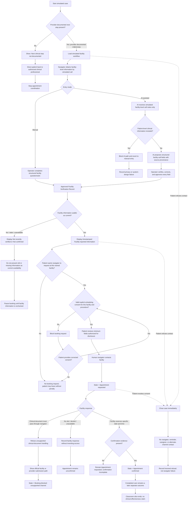

# WEEK 5 — BUSINESS BENDING
## PACKET BEFORE CODE

**Project:** When Care Arrives Too Late — or Through a Screen  
**Role:** Adversary  
**Working slice:** Bounded referral-to-appointment coordination after a provider-documented next step  
**Candidate procedure:** Colposcopy  
**Source of truth:** Final Week 5 Blueprint. This Packet does not reopen or redesign settled product decisions.

---

## 1. Problem in my words

The problem is not detecting disease and it is not deciding what medical care a patient needs. This slice starts only after an authorized provider has already documented the next clinical step.

The bounded problem is the gap between **“my provider told me the next step is colposcopy”** and **“I have a real appointment that a facility has actually reserved for me.”** A patient can know the name of the next procedure and still face unclear requirements, changing availability, uncertain costs, repeated calls, and information that looks more certain than it really is. A static clinic list does not solve that problem, and an appointment request is not the same as a confirmed appointment.

This prototype therefore tests one narrow coordination workflow: human operators maintain timestamped facility-level information, the patient controls whether a navigator may request an appointment, the system keeps every state separate, and the optional AI experiment may propose structure from **facility-level call notes only** for human approval. The prototype does not interpret screening results, infer a next clinical step, diagnose, recommend treatment, or claim that the classroom workflow improves real clinical outcomes.

---

## 2. Exact user

The primary user for this working slice is:

> **A simulated patient who already has a provider-documented next step of colposcopy and needs help moving from that documented referral to a real appointment request and, if the facility actually reserves one, a confirmed appointment.**

The patient is not required to understand or interpret the screening result inside this product. The product only needs the already documented next step. If the next step is missing, the case cannot enter appointment coordination and must return to an authorized clinical professional.

A **navigator / human operator** is a required workflow actor, but not a replacement clinician. A daughter, caregiver, or other support person is not automatically an authorized user and receives no patient access or decision authority by default.

The classroom prototype does not implement or present any payer, controller, municipality, facility network, or institutional partner as validated. Brain Bending proposed **IMSS-Bienestar as a future payer and as the intended controller if it formally accepts that role for a real pilot**; those roles remain hypotheses that require actual institutional acceptance, legal review, governance, and operating agreements. This build does not demonstrate or assume that commitment.

---

## 3. Success definition

> **Before the module closes, a simulated patient with a provider-documented colposcopy next step can review timestamped facility information, give facility-specific scheduling consent, move to Appointment requested through a human navigator, and reach Appointment confirmed only when simulated facility confirmation evidence is present.**

For the classroom build, that means a simulated case can mechanically demonstrate all of the following:

- a provider-documented next step of **colposcopy** is required before coordination begins;
- explicit scheduling consent is collected for one named simulated facility and one documented procedure;
- the navigator can enter or approve timestamped **facility-reported information**;
- stale, missing, or unconfirmed facility information remains visibly uncertain;
- the optional AI path can propose structured fields from **simulated facility-level call notes only**, while a human operator verifies every field before publication;
- **Facility-reported information**, **Appointment requested**, and **Appointment confirmed** remain separate states;
- an appointment cannot become confirmed without specific simulated facility confirmation evidence, including a reserved date and time;
- refusal or revocation closes the communication path rather than being treated as navigator failure;
- support-person permissions remain separate from patient permissions;
- the interface is visibly labeled as a classroom prototype using simulated data only.

### What this classroom prototype can demonstrate

The build can demonstrate workflow logic, form validation, state transitions, consent boundaries, minimum-necessary disclosure logic, stale-information handling, operator approval, audit-style provenance, AI scope restrictions, stopping rules, and simulated-data labeling.

### What this classroom prototype cannot demonstrate

The build cannot prove that the intervention increases completed colposcopies by **15 percentage points within 60 calendar days**, lowers median time to completion, reduces patient or caregiver burden, lowers cost, improves equity, has adequate facility capacity, is safe for real patient data, or is better than structured staff outreach in the real world. Those are real-pilot or properly powered evaluation questions. The 60-day window is an operational evaluation period established during Brain Bending, not a medical recommendation about how long a patient should wait.

---

## 4. IMAGE-GENERATED MOCKUP

The minimum honest demonstration needs four logical views because one screen cannot show the patient boundary, the human/AI boundary, facility uncertainty, and booking-state separation without collapsing them:

1. **Simulated case + consent:** provider-documented colposcopy, named simulated facility, explicit scheduling consent, and separate support-person permission.
2. **Navigator facility-call capture:** the structured facility signal and the optional AI extraction experiment, with no patient-level clinical information sent to AI and mandatory human approval.
3. **Facility information:** timestamped facility-reported service information with visible uncertainty/staleness; no appointment is implied.
4. **Booking status:** Facility-reported information → Appointment requested → Appointment confirmed, with confirmation evidence required and stop-contact behavior visible.

.png)

**Caption:** The mockup demonstrates the classroom-only working slice: a simulated provider-documented colposcopy referral moves through explicit consent, human-maintained facility information, bounded AI-assisted structuring, and separate facility-information/request/confirmation states without diagnosis, clinical inference, real patient data, or unsupported access claims.

---

## 5. FEATURE FLOWCHART — MERMAID

---

## 6. ACTOR SWIMLANE — MERMAID

```mermaid
flowchart LR
    subgraph PAT[Patient]
        P1[Arrives with provider-documented colposcopy next step]
        P2[Reviews timestamped facility information and uncertainty]
        P3[Chooses whether to request at one named facility]
        P4[Reviews minimum disclosure fields]
        P5[Gives, refuses, or revokes scheduling consent]
        P6[May separately authorize a support person]
        P7[If required, sends clinical document through official facility/provider channel]
        P8[May stop contact at any time]
    end

    subgraph NAV[Navigator / human operator]
        N1[Calls simulated facility using fixed questionnaire]
        N2[Records facility-reported service information]
        N3[Verifies or corrects any AI-proposed fields]
        N4[Requests appointment only with valid patient consent]
        N5[Discloses only authorized minimum scheduling fields]
        N6[Refuses unsupported clinical-document handling]
        N7[Stops all contact after refusal or revocation]
    end

    subgraph SYS[System]
        S1[Validates required case and form fields]
        S2[Stores timestamp, source, and approved facility record]
        S3[Marks stale or unavailable information as uncertain]
        S4[Enforces Facility-reported / Requested / Confirmed as separate states]
        S5[Blocks confirmation without reserved date/time plus facility confirmation evidence]
        S6[Keeps patient permission separate from support-person permission]
        S7[Records state changes and stopping rules]
    end

    subgraph AI[AI]
        A1[Receives simulated facility-level call notes only]
        A2[Proposes structured facility fields]
        A3[Leaves unsupported or missing facts unconfirmed]
        A4[No diagnosis, clinical inference, patient matching, booking, or direct publication]
    end

    subgraph FAC[Facility]
        F1[Reports general service information]
        F2[Reports general availability, stated charges, prerequisites, and acceptance rules]
        F3[Receives appointment request from human navigator]
        F4[Confirms, denies, or cannot complete request]
        F5[If confirming, reserves specific date/time and provides confirmation source]
    end

    P1 --> S1
    S1 --> N1
    N1 --> F1
    F1 --> N2
    F2 --> N2

    N2 --> S2
    N2 -. Optional AI assist .-> A1
    A1 --> A2
    A2 --> N3
    A3 --> N3
    N3 --> S2

    S2 --> S3
    S3 --> P2
    P2 --> P3
    P3 --> P4
    P4 --> P5

    P5 --> S6
    P6 --> S6
    S6 --> N4
    N4 --> N5
    N5 --> F3

    F3 --> F4
    F4 --> S4
    F4 --> F5
    F5 --> S5
    S5 --> P2

    F4 -. Clinical document required .-> N6
    N6 --> P7

    P8 --> N7
    N7 --> S7
```

### Authority boundary summary

- **Patient:** controls participation, disclosure, support-person access, and stopping.
- **Navigator:** obtains and verifies operational facility information and performs the patient-level appointment request; does not interpret medicine.
- **System:** validates, records provenance, and enforces deterministic state and permission rules.
- **AI:** proposes structure from facility-level notes only; it has no patient authority, booking authority, or clinical authority.
- **Facility:** is the only actor that can turn a request into a facility-confirmed reservation.

---

## 7. Benchmark line

> **“The best existing solution on Earth for this is structured staff outreach with basic scheduling support, represented by the NCI-funded multilevel outreach trial.”**

> **“Mine differs or localizes by adding tightly bounded, human-maintained facility-call information and consented appointment-request coordination for a provider-documented colposcopy next step in Mexico, while testing whether that extra layer actually beats the stronger control rather than assuming it does.”**

The future real evaluation must compare against a credible low-cost control, not usual care or a static directory. The classroom prototype does not claim to win that comparison.

---

## 8. Long view

If this slice worked, the full product could become a narrowly governed human-navigation service that coordinates provider-documented referrals across a limited set of participating procedures and facilities while preserving consent, provenance, uncertainty, and separate workflow states. Over three years, it could earn expansion only where real partners validate capacity, governance, procurement, and outcome improvement against structured outreach, with AI retained only where it demonstrably supports the workflow without lowering reliability. It would still remain a coordination layer rather than a diagnostic system, and any broader geography, payer model, clinical integration, or institutional infrastructure would have to be validated rather than assumed.

---

## 9. Scope cut — what we are NOT building

This classroom slice is **not** building any of the following:

- a symptom checker, general healthcare chatbot, screening tool, or AI diagnostic product;
- a system that decides whether a patient has cancer or another disease;
- interpretation of a screening result, screenshot, image, pathology, referral document, or clinical note;
- inference of the next clinical step, urgency, severity, risk level, treatment, or preparation instructions not explicitly reported by the provider/facility;
- automatic conversion of “abnormal result” into “colposcopy”; colposcopy must already be provider-documented for the case to enter this slice;
- patient-level clinical information sent to the LLM;
- AI patient matching, AI booking authority, AI clinical advice, AI publication without human approval, or AI-generated missing facts;
- a patient upload flow for screening results or referral documents;
- navigator storage, extraction, summarization, or forwarding of clinical documents; if a facility requires one, the patient/provider must use the facility’s official channel;
- a national provider directory, national referral infrastructure, shared identifier, EHR integration, or real-time scheduling integration;
- a promise that facility-reported availability is still available to the patient;
- a promise that a requested appointment is confirmed;
- a claim that a confirmed appointment means the procedure was completed;
- an “affordable” score or label; provider-reported charges and patient burden are different concepts;
- automatic reminders, unlimited outreach, pressure loops, or contact after refusal/revocation;
- default caregiver/support-person access or authority;
- a combined metric that collapses scheduling, completion, cost, patient burden, support-person burden, or ethical quality into one score;
- real patient information, real clinical records, or real sensitive personal data;
- a claim that a simulated consent control is legally sufficient consent for a real patient-data workflow;
- a claim that IMSS-Bienestar is a validated payer or controller for this classroom build;
- a claim that any real facility has agreed to participate, has spare capacity, or will accept patient-level booking through this workflow;
- a claim that the municipality/service region, procurement route, budget owner, data controller, institutional participation, or long-term funding model is established;
- a claim that this classroom build proves the real-world 15-percentage-point completion threshold, 60-day clinical impact, reduced burden, economic value, equity, or safety.

---

## 10. Architecture + stack table

### Smallest free stack for this classroom slice

The Week 5 stack floor is met with **one LLM + one structured signal**.

**Structured signal: a fixed Facility Verification Questionnaire completed from each simulated facility call and stored as a Facility Verification Record.**

Its fixed structured fields are:

- procedure/service offered;
- reported general availability;
- stated medical charge and stated exclusions;
- prerequisites;
- acceptance/referral rules;
- facility/source contact;
- verification timestamp;
- freshness/uncertainty status;
- operator approval status.

| Component | Technology | Purpose | Data handled | Why it is necessary |
|---|---|---|---|---|
| Web app | Next.js + TypeScript | Build the patient, navigator, facility-information, and booking-state views | Simulated case state and simulated facility records | Small single-codebase app with deterministic client/server logic |
| Styling | Plain CSS or minimal Tailwind CSS | Make state labels, consent, uncertainty, and warnings visually clear | No separate data | Needed for readable, testable state separation without a heavy UI library |
| Structured signal | Fixed Facility Verification Questionnaire + TypeScript schema + Zod | Capture and validate the structured signal from each simulated facility call and store it as a Facility Verification Record | Simulated facility-level structured fields only | Explicitly satisfies the Week 5 structured-signal requirement and prevents free-form ambiguity from becoming authoritative state |
| LLM | Course-approved free-tier Gemini API through a server route | Experimental proposal of structured fields from simulated facility-call notes | **Facility-level simulated notes only; no patient identifiers, results, referrals, clinical documents, or case IDs** | Satisfies the LLM floor while preserving the bounded AI role |
| Deterministic workflow engine | TypeScript functions/state machine | Enforce consent, uncertainty, state transitions, stopping rules, and confirmation evidence | Simulated case status, consent flags, timestamps, and facility status | Authority boundaries must not depend on probabilistic AI |
| Demo data | Local static JSON/TypeScript fixtures | Seed invented facilities, notes, timestamps, charges, and cases | Invented/simulated data only | Enables a working classroom demo without inventing real institutional participation |
| Runtime case state | In-memory React state | Hold the active simulated case during the demo | Simulated case only | Avoids unnecessary personal-data storage, authentication, and database infrastructure |
| Server secret handling | Vercel environment variable | Keep the LLM key server-side | API key only | Meets the Security Floor: no secrets in code, repo, or client bundle |
| Deployment | Vercel free tier | Host the classroom prototype | Built application only | Simple free deployment path suited to the course workflow |
| Unit tests | Vitest | Test deterministic rules, schemas, permissions, state transitions, and safety boundaries | Synthetic test fixtures | Fast protection for load-bearing Blueprint conditions |
| Browser / Mechanical Pass | Playwright | Execute Packet scenarios against the deployed app | Simulated browser state only | Supports the required bug-hunt, fix, redeploy, and retest cycle |

### Security Floor before build

- **No secrets in code or the repository.** The LLM key must exist only in the server environment.
- **Simulated data only.** The app must not ask for or intentionally accept real patient information.
- **No personal-data storage in this classroom slice.** Because the prototype uses in-memory simulated state only, user authentication is not required.
- **No Supabase user-data tables are needed.** Therefore RLS is not applicable to this minimum slice. If a later approved build stores personal data in Supabase, authentication and RLS become mandatory before use.
- **Every form validates input.** Zod/TypeScript schemas validate required fields, allowed values, lengths, timestamps, consent scope, and confirmation evidence before state transitions or LLM use.
- **Patient-level clinical information must never enter the LLM path.** If such content appears, the AI-assisted path must be blocked or revert to manual entry.
- **Clinical documents are out of scope.** No upload, parsing, storage, summarization, forwarding, or AI processing of screening results or referrals.
- **Safe rendering is required.** User-editable or model-returned strings must render as text, not executable HTML.
- **The classroom consent control is a workflow simulation, not a legal claim.** It must not be described as sufficient authorization for real sensitive-health-data processing.

---

## 11. Test plan

**Mechanical-test status before code:** every test below is **Not run — planned before code**. During the Mechanical Pass, tests must be executed truthfully against the deployed app. At least one real bug/failure must be found, documented, fixed, redeployed, and retested; a bug must not be invented merely to satisfy the requirement.

| ID | Test | Actions | Expected result |
|---|---|---|---|
| **T01** | Happy path | Load a simulated case with provider-documented colposcopy → approve current facility information → patient gives valid facility-specific scheduling consent → human navigator requests → simulated facility supplies reserved date/time plus confirmation source | States advance in order: Facility-reported information → Appointment requested → Appointment confirmed. Completion remains separate and not demonstrated. |
| **T02** | Missing provider-defined next step | Remove the documented procedure and attempt to continue | Show **Next clinical step not documented**; appointment coordination stops; no AI or system inference fills the gap. |
| **T03** | Invalid/missing facility input | Omit procedure, source, timestamp, or use invalid values | Validation blocks approval/state change; app does not crash or invent a value. |
| **T04** | Missing consent | Attempt appointment request without scheduling consent | Request action is blocked. Facility information may remain visible, but no patient-level appointment request is sent/simulated. |
| **T05** | Consent scope mismatch | Consent to Facility A, then attempt request at Facility B or for a different procedure | Existing consent cannot be reused; new explicit consent is required. |
| **T06** | Revocation / refusal | Give consent, then select **Stop contacting me** or revoke before confirmation | Case closes immediately; further navigator/reminder/caregiver/alternate-channel contact actions are disabled; refusal is labeled honored choice, not navigator failure. |
| **T07** | Unauthorized support person | Give no support-person permission and attempt caregiver view/action | Support person has no access or authority. Patient scheduling consent does not silently grant support-person access. |
| **T08** | State separation | Load facility-reported information; then request; inspect labels before confirmation evidence exists | Facility-reported information never displays as a reserved appointment. Appointment requested never displays as confirmed. |
| **T09** | **Targeted Mechanical Pass bug hunt: stale confirmation state** | Reach Appointment confirmed, then remove/change the reserved date/time or confirmation evidence and navigate away/back | UI must immediately downgrade from confirmed. A stale green **Appointment confirmed** state may not survive after its supporting evidence is invalidated. This test is intentionally designed to catch a meaningful state-caching bug. |
| **T10** | Stale facility information | Load a simulated facility record explicitly marked as stale and with an older verification timestamp | Show **Not recently verified** or equivalent uncertainty. Do not present old facility information as current availability. |
| **T11** | Facility information unavailable | Leave availability, price, prerequisite, or another structured field unconfirmed | Missing value stays **Not confirmed** / unavailable. No estimate, invented value, or optimistic default is created. |
| **T12** | AI patient-data boundary | Put a simulated patient name, phone number, screening result, referral text, clinical document text, or case identifier into the AI-input area | AI path is blocked/rejected and manual structured entry remains available. No patient-level clinical information is sent to the LLM. |
| **T13** | AI inference boundary | Give facility notes that omit price, eligibility, availability, or another field | AI may only propose source-supported facility fields; omitted facts remain unconfirmed. It must not infer clinical meaning, urgency, patient eligibility, or the next clinical step. |
| **T14** | Human approval boundary | Run AI-assisted extraction but do not approve the proposed fields | Nothing becomes patient-facing or authoritative until the human operator approves/corrects the Facility Verification Record. |
| **T15** | Unsupported AI output protection | Use a mocked AI response that fabricates or materially changes appointment timing, price, procedure, prerequisite, location, or source | Validation and human review prevent the unsupported field from publishing. The record remains unapproved, manual entry remains available, and the failure can be logged for review. The Packet makes no new numeric AI kill rule. |
| **T16** | AI value-claim boundary | Compare the manual structured-questionnaire path and the optional AI-assisted path; inspect AI labels and summary text | The fixed questionnaire works without AI. AI is labeled experimental/bounded, and the classroom build does not claim that AI improves cost, speed, safety, or outcomes without real comparison evidence. |
| **T17** | Simulated-data labeling | Inspect every page/view and any exported or copied demo state | **Classroom prototype — simulated data only** is visible. Invented facilities/cases are not presented as real institutions or real patients. |
| **T18** | Real-data prevention | Attempt to enter obvious real-person contact or clinical content into fields not intended for patient data | Input is rejected, constrained to fixed simulated fixtures, or triggers a clear simulated-data-only warning. The app never invites real clinical uploads. |
| **T19** | Clinical document boundary | Simulate a facility saying a referral/result document must be sent through the navigator | Navigator/system refuses to upload, extract, summarize, read aloud, store, or send it; show **Booking blocked: clinical document required through an unsupported channel** and point to the official facility/provider channel. |
| **T20** | Confirmation evidence requirement | Facility says “we probably have space” or gives general availability but no reserved patient date/time and confirmation source | State stays Facility-reported information or Appointment requested. It cannot become Appointment confirmed. |
| **T21** | Cost / burden separation | Display provider-stated medical charge and any simulated patient burden fields | Do not label an option “affordable.” Medical charge, travel, missed work, and support-person burden remain separate concepts; no composite score is created. |
| **T22** | Completion separation | Reach Appointment confirmed and inspect outcome display | Appointment confirmed does not become **completed colposcopy**. The classroom app states that completion impact is not tested. |
| **T23** | Institutional claim boundary | Inspect all screens, seeded facility names, payer/controller copy, geography, procurement, and capacity language | No real facility, municipality, budget owner, procurement route, capacity commitment, or institutional partnership is presented as validated. If IMSS-Bienestar is referenced, it is labeled as a proposed future payer/controller role that remains unvalidated in this build. |
| **T24** | Shadow-clause pressure check | Inspect flows after no response/refusal and search UI for repeated-contact controls, streaks, urgency nudges, navigator leaderboards, or completion incentives | No unlimited/automatic pressure loop exists. Refusal closes the case. Navigators cannot erase refusal and are not scored in a way that pressures them to override patient choice. |
| **T25** | Secrets and client exposure | Inspect repo, built client bundle/source maps, browser network, console, and deployment environment behavior | No LLM API key appears in tracked code or client output. LLM calls are server-side only. |
| **T26** | Safe rendering / form validation | Enter HTML/script strings, overlong values, invalid enums, malformed timestamps, and missing consent/facility fields | Content renders as text; no script executes; invalid data cannot create an approved facility record, appointment request, or confirmation. |
| **T27** | No unnecessary auth/database claim | Inspect code and runtime storage | No real personal data is stored; no unnecessary Supabase/user table exists. The app does not claim privacy compliance merely because it uses simulated data. |
| **T28** | Blueprint kill-test claim boundary | Inspect final demo summary | Demo may say the workflow mechanically worked. It may **not** say it achieved +15 percentage points in completion, beat structured outreach, reduced burden/cost, proved payer willingness, or validated real facility capacity. |

### Persona Test plan

- A **FRESH chat** will receive a synthetic persona based on the Week 5 user research.
- Screens 1–4 will be shown in order.
- The persona will attempt the task while narrating confusion, hesitation, and where they would quit.
- Every confusion will be logged.
- The worst confusion will be fixed.
- The app will be redeployed.
- The revised screen/flow will be retested.
- The persona-test evidence will later be turned into **`PERSONA_AnaMariaMatas.pdf`**.
- No persona-test result is claimed in this Packet because the Persona Test has not happened yet.

---

## 12. Blueprint Conditions Traceability

| Load-bearing Blueprint / Brain Bending condition | Where it appears in this Packet | How the build will honor it | How it will be tested |
|---|---|---|---|
| Start only after a valid provider-defined next step | §§1–3, 5, 9 | Colposcopy must be explicitly present as the provider-documented next step; missing step stops coordination | T02 |
| System never chooses colposcopy or another next step | §§1–3, 5, 9 | The next step is an input from an authorized provider, never a model/system output | T02, T13 |
| No diagnosis or clinical-result interpretation | §§1, 3–6, 9–10 | Workflow never interprets the screening result; AI sees facility-level notes only | T02, T12, T13, T19 |
| No result without a clear next action | §§1–3, 5 | If the next clinical step is missing, user is directed back to an authorized clinical professional; no fake pathway is generated | T02 |
| Completed care is the real outcome, not activity | §§3, 5, 8–9, 11 | Facility information, request, confirmation, and later completion remain distinct concepts | T08, T20, T22, T28 |
| Real-pilot completion window and material-improvement criterion are not classroom claims | §§3, 9, 11 | The classroom demo can show workflow states but cannot claim the 60-day / +15-point real-pilot outcome | T22, T28 |
| Strong comparator is structured staff outreach/basic scheduling support | §7 | Benchmark/control remains explicit; no comparison against a straw-man static directory | T28 |
| Technology cannot replace human support | §§1, 5–6, 10 | Human operator calls facilities, approves AI output, requests appointments, and handles blocked cases | T14, T19 |
| Human operators maintain facility-level information | §§1, 4–6, 10 | Fixed Facility Verification Questionnaire is completed from simulated human facility calls | T01, T03, T10, T11 |
| Week 5 stack floor = LLM + one structured signal | §10 | Structured signal is the fixed Facility Verification Questionnaire stored as a Facility Verification Record; LLM is separate and bounded | T03, T13, T14, T16 |
| Costs and availability are transparent, sourced, and uncertain when necessary | §§1, 4–5, 9–10 | Show source/timestamp, stated charge/exclusions, and uncertainty states; no affordability promise | T10, T11, T20, T21 |
| Facility-reported information ≠ Appointment requested ≠ Appointment confirmed | §§3–6, 9 | Deterministic state machine prevents merged states | T01, T08, T09, T20 |
| Confirmation requires patient-specific simulated facility evidence | §§3–6, 11 | Specific reserved date/time plus confirmation source is required | T01, T09, T20 |
| Confirmed appointment ≠ completed care | §§3–5, 8–9, 11 | Completion remains outside the classroom booking slice and cannot be auto-inferred | T22, T28 |
| Explicit scheduling consent for one named facility and documented procedure | §§2–6, 9–10 | Consent is facility/procedure specific and required before navigator request | T04, T05 |
| Minimum-necessary disclosure | §§4–6, 9 | Navigator discloses only authorized scheduling fields | T05, T19 |
| Clinical documents are not handled by navigator or AI | §§5–6, 9–10 | Unsupported-channel block; patient/provider uses official facility channel | T12, T19 |
| SHADOW CLAUSE: patient control first | §§2–6, 9, 11 | No pressure loop; refusal/revocation immediately closes contact | T06, T24 |
| Caregiver/support-person permissions separate from patient permissions | §§2, 4, 6, 9 | No default access; separate authorization required | T07 |
| Refusal is honored and is not navigator failure | §§3–6, 9, 11 | Closed-case state preserves refusal without negative operator interpretation | T06, T24 |
| Patient/support-person burden must not be collapsed into completion | §§3, 8–9, 11 | No single success score; burden and workflow outcomes remain separate | T21, T22 |
| AI has one bounded experimental job only | §§1, 4–6, 9–11 | AI may propose facility-call fields only; no patient data, clinical inference, matching, booking, or direct publication | T12–T16 |
| AI output cannot publish without human approval | §§4–6, 10–11 | Operator approval is mandatory before facility information becomes authoritative/patient-facing | T14, T15 |
| No new AI numeric threshold is invented in this Packet | §§10–11 | Packet keeps AI qualitative/boundary tests only unless a numeric rule is explicitly carried by the final Blueprint | T15, T16 |
| Simulated patient data only | §§1–4, 9–11 | All fixtures are invented; no real clinical uploads or real patient capture | T17, T18, T27 |
| No unsupported verification claims | §§1, 3–5, 9 | Stale/unknown values remain uncertain; facility-reported information never equals patient access | T10, T11, T20 |
| IMSS-Bienestar is proposed for a future real pilot, not validated by this build | §§2, 9, 11 | If named, it is labeled proposed/unvalidated; no payer/controller commitment is simulated as fact | T23, T28 |
| Real payer/controller/facility participation remains unvalidated | §§2–3, 8–9, 11 | UI uses invented facilities and does not assert institutional acceptance, governance, procurement, or capacity | T23, T28 |
| Exact geography/service region remains unvalidated | §§2, 8–9 | No real municipality is selected or implied as participating | T23 |
| Facility capacity cannot be created by software | §§3, 8–9 | Prototype coordinates only simulated availability and makes no capacity claim | T23, T28 |
| Financing problem is not solved by this product | §§1, 9, 11 | Charges may be displayed separately; no coverage, affordability, or financial-protection claim | T21, T23 |
| Security Floor applies before code | §10 | No repo secrets; auth/RLS if personal storage is later approved; form validation; simulated data only | T17, T18, T25–T27 |
| Classroom build proves workflow, not clinical effectiveness | §§3, 8–11 | Demo summary uses mechanical/operational language only | T17, T22, T28 |
| Persona Test must be performed after build in a fresh chat | §11 | Planned procedure is documented without fabricating results | Persona Test plan |

---

## Final consistency audit before code

This complete Packet has been audited against the **Final Week 5 Blueprint**, the **Week 5 assignment instructions**, and the **Security Floor**.

- **No symptom checker exists.**
- **No diagnosis is performed.**
- **No screening or clinical result is interpreted.**
- **The system never chooses colposcopy; colposcopy must already be provider-documented.**
- **Patient-level clinical information never goes to the LLM.**
- **AI does not replace the navigator.**
- **AI output cannot publish without human approval.**
- **Facility-reported information is not represented as an appointment.**
- **Appointment requested is not represented as Appointment confirmed.**
- **Appointment confirmed is not represented as completed care.**
- **Refusal/revocation closes contact immediately.**
- **Support-person permission remains separate from patient permission.**
- **No real patient data is used.**
- **All demo patients, facilities, calls, timestamps, prices, and confirmation evidence are simulated and must be labeled as such.**
- **No real payer, controller, facility, municipality, procurement path, capacity, or institutional partnership is falsely presented as validated.**
- **IMSS-Bienestar remains a proposed future payer/controller role from Brain Bending, not a validated participant in this build.**
- **The classroom prototype makes workflow claims only, not clinical-effectiveness claims.**
- **All Blueprint shadow-clause protections remain intact.**
- **The previously invented 48-hour freshness rule has been removed; stale information is tested without inventing a new numeric threshold.**
- **AI experiment numeric thresholds and numeric kill rules are not restated as Packet requirements unless they are explicitly present in the Final Blueprint.**
- **No new numerical rule or policy has been invented during Packet creation.**

**STOP after Packet approval. Do not create the Implementation Prompt or application code until Step 2 is explicitly requested.**
